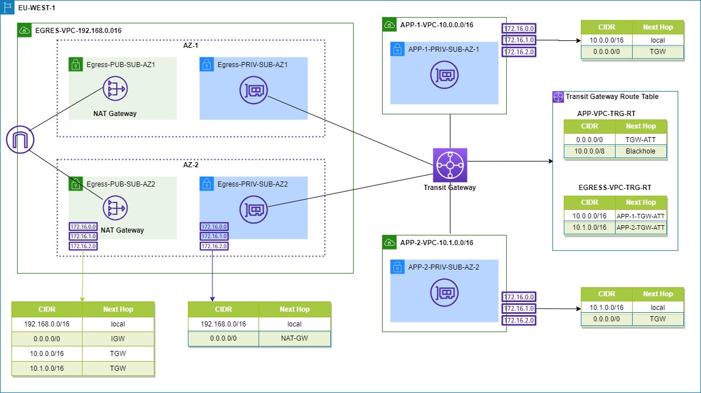

# Creating a single internet exit point from multiple VPCs Using AWS Transit Gateway

## Centralizing Outbound Internet Traffic with AWS Transit Gateway 🌐

In this discussion, we delve into the implementation of a solution to centralize outbound internet traffic across multiple Virtual Private Clouds (VPCs) without compromising VPC isolation. Leveraging the capabilities of AWS Transit Gateway, you can establish a streamlined configuration, utilizing a single VPC equipped with multiple NAT gateways. This approach facilitates the consolidation of outbound traffic for numerous VPCs, all while maintaining robust VPC-to-VPC isolation through the use of multiple route tables within the transit gateway. The resulting hub-and-spoke design empowers you to efficiently oversee all outbound internet communication from a centralized and secure location.

### Traditional Challenges 🔄

In the absence of AWS Transit Gateway, the traditional approach involves combining an internet gateway with NAT gateways or NAT instances for each VPC requiring outbound internet access. However, as the number of VPCs grows, the management of multiple internet gateways, NAT gateways, and instances becomes labor-intensive and cost-inefficient. In such scenarios, AWS Transit Gateway offers a viable solution, allowing you to consolidate outbound traffic efficiently.

### Enhanced Flexibility with Security Appliances 🛡️

Moreover, while this centralized architecture is designed around a pair of shared NAT gateways, it is adaptable to incorporate other security appliances. These appliances can perform tasks such as traffic capture, policy enforcement, web filtering, provided they possess the necessary capabilities to fulfill the NAT function and adhere to required route configurations. This flexibility enables the modification of the architecture to align with specific security and compliance requirements.

### Creating and Configuring the VPCs

1. Create the following three VPCs: Egress-VPC, App1-VPC, and App2-VPC. Provide values for each, as shown in the following table. For more information, see [Getting Started with Amazon VPC](https://docs.aws.amazon.com/AmazonVPC/latest/UserGuide/GetStarted.html).
   
   | VPC name     | IPv4 CIDR       | IPv6 CIDR       | Tenancy  |
   | ------------ | --------------- | --------------- | -------- |
   | Egress-VPC   | 192.168.0.0/16  | No IPv6 CIDR Block | Default  |
   | App1-VPC     | 10.0.0.0/16     | No IPv6 CIDR Block | Default  |
   | App2-VPC     | 10.1.0.0/16     | No IPv6 CIDR Block | Default  |

### Create Subnets in Each VPCs

2. Create the subnets in each of the VPCs as described in the following table. In the next steps, you configure the route tables to make some of these subnets public.

| Subnet name           | Tag             | AZ         | IPv4           |
| --------------------- | --------------- | ------------| -------------|
| Egress-Public-AZ1     | Egress-VPC      | eu-west-3a  | 192.168.1.0/24  |
| Egress-Public-AZ2     | Egress-VPC      | eu-west-3b  | 192.168.2.0/24  |
| Egress-Private-AZ1    | Egress-VPC      | eu-west-3a  | 192.168.3.0/24  |
| Egress-Private-AZ2    | Egress-VPC      | eu-west-3b  | 192.168.4.0/24  |
| App1-Private-AZ1      | App1-VPC        | eu-west-3a  | 10.0.1.0/24     |
| App1-Private-AZ2      | App1-VPC        | eu-west-3b  | 10.0.2.0/24     |
| App2-Private-AZ1      | App2-VPC        | eu-west-3a  | 10.1.1.0/24     |
| App2-Private-AZ2      | App2-VPC        | eu-west-3b  | 10.1.2.0/24     |

### Configuring Internet and Route Tables 🌐🚀

3. Create and attach an internet gateway to the VPC Egress-VPC. Use IGW as the Name tag for this internet gateway. For more information, see [Creating and Attaching an Internet Gateway](https://docs.aws.amazon.com/AmazonVPC/latest/UserGuide/VPC_Internet_Gateway.html#Add_IGW_Attach_Gateway).

4. Create a NAT gateway in the VPC Egress-VPC. For more information, see [NAT gateways](https://docs.aws.amazon.com/vpc/latest/userguide/vpc-nat-gateway.html).Create only one NAT gateway for this example. In your production environment, you should create a NAT gateway for every Availability Zone in which you have a subnet and use the NAT gateway in the same Availability zone. 
- For Subnet, enter Egress-Public-AZ1. 
- For Elastic IP Allocation ID, choose Create new EIP.

5. Create two new route tables in Egress-VPC. For Name tags, use Egress-Public-RT and Egress-Private-RT.

6. Add a new default route in the route table Egress-Public-RT, with the destination set to 0.0.0.0/0. Associate the route with the internet gateway IGW. For more information, see [Adding and Removing Routes from a route table](https://docs.aws.amazon.com/AmazonVPC/latest/UserGuide/VPC_Route_Tables.html#AddRemoveRoutes). Then edit the subnet association and add both the Egress-Public-AZ1 and Egress-Public-AZ2 subnets to this route table.

7. Add a new default route in the route table Egress-Private-RT, with the destination 0.0.0.0/0. Associate the route with the NAT gateway. Then edit the subnet association, adding both the Egress-Private-AZ1 and Egress-Private-AZ2 subnets to this route table.

### Deploying and Configuring the Transit Gateway 🚀

In the following steps, we guide you through the deployment of a new transit gateway and its configuration, seamlessly connecting it to all three VPCs while efficiently routing traffic to the internet through the NAT gateway. To achieve this, follow the steps outlined below:

1. In the AWS VPC console:
    - Navigate to **AWS Transit Gateway**.
    - Create a new transit gateway, assigning it the name `TGW-Internet`.
    - Add a suitable description for clarity.
    - Ensure to uncheck both **Default route table propagation** and **Default route table association**.

2. Access **Transit Gateway Attachments**:
    - Create the necessary attachments following the details provided in the table below.

| AWS Transit Gateway ID | Attachment Type | Attachment Name Tag | Subnet IDs                          |
|------------------------|------------------|----------------------|-------------------------------------|
| TGW-Internet           | VPC              | Egress-Attachment    | Egress-Private-AZ1, Egress-Private-AZ2 |
| TGW-Internet           | VPC              | App1-Attachment      | App1-Private-AZ1, App1-Private-AZ2     |
| TGW-Internet           | VPC              | App2-Attachment      | App2-Private-AZ1, App2-Private-AZ2     |

By meticulously completing these steps, you establish a cohesive integration between the transit gateway and all three VPCs, paving the way for streamlined routing of internet-bound traffic through the designated NAT gateway.

### Configuring AWS Transit Gateway Route Tables 🌐

1. Choose **AWS Transit Gateway Route Tables** and create two route tables:
   - Name the first route table as `Egress-RouteTable`.
   - Name the second route table as `App-RouteTable`.
   - Associate both route tables with the `TGW-Internet` transit gateway.

2. Under **AWS Transit Gateway Route Tables**:
   - Choose `App-RouteTable`.
   - Navigate to **Associations** and create an association.
   - Associate both `App1-Attachment` and `App2-Attachment` to this route table.

3. On the same `App-RouteTable`, go to **Routes**:
   - Create a route by entering `0.0.0.0/0` and choose the attachment: `Egress-VPC`.
   - Add additional routes: `10.0.0.0/8` with the Action set to **Blackhole** to ensure VPCs can’t communicate with each other through the NAT gateway.

4. Under **AWS Transit Gateway Route Tables**:
   - Choose `Egress-RouteTable`.
   - Navigate to **Associations** and create an association.
   - Associate `Egress-Attachment` to this route table.

5. On the same `Egress-RouteTable`, go to **Routes**:
   - Choose **Create route** and enter `10.0.0.0/16` with the attachment `App1-Attachment`.
   - Enter a second route for `10.1.0.0/16` with the attachment `App2-Attachment`.

6. In the left navigation pane, choose **Route Tables**:
   - Edit the default route table associated with `App1-VPC` and `App2-VPC`.
   - Add a route for `0.0.0.0/0` and set `TGW-Internet` as the target.

7. Edit the `Egress-Public-RT` route table associated with the `Egress-VPC`:
   - Add routes for `10.0.0.0/16` and `10.1.0.0/16`.
   - Set `TGW-Internet` as the target.

These steps provide a comprehensive guide to configuring AWS Transit Gateway Route Tables, ensuring effective management of traffic within the VPC network architecture.

### Launching Test Instances 🚀

To evaluate and test the configured setup, proceed with launching three EC2 instances as follows:

### Bastion Host in Egress-VPC:
Launch an EC2 Instance in the `Egress-VPC` with the following configuration:

- **AMI:** Amazon Linux 2 AMI (HVM)
- **Instance Type:** t2.micro
- **Network:** Egress-VPC
- **Subnet:** Egress-Public-AZ1
- **Auto Assign Public IP:** Enabled
- **Tags:** Add a tag with Key: Name and Value: Bastion
- **Security Group:** Create a new security group to allow SSH traffic from your Public IP address (you can find your current IP address by browsing to [www.myipaddress.com](http://www.myipaddress.com))

### Instances in App1-VPC and App2-VPC:
Launch two EC2 instances, one in `App1-VPC` and the other in `App2-VPC` with the following configuration:

- **AMI:** Amazon Linux 2 AMI (HVM)
- **Instance Type:** t2.micro
- **Network:** App1-VPC (for the first instance) and App2-VPC (for the second instance)
- **Subnet:** App1-Private-AZ1 (for App1-VPC) and App2-Private-AZ1 (for App2-VPC)
- **Auto Assign Public IP:** Disabled
- **Tags:** Add a tag with Key: Name and Value: App1VM (for App1-VPC) and App2VM (for App2-VPC)
- **Inbound Security Group:** Create a new security group to allow SSH & All ICMP – IPV4 traffic from 10.0.0.0/16, 10.1.0.0/16 & 192.168.0.0/16.

Repeat the configuration for the second EC2 instance in `App2-VPC`.

Reference: [AWS Blog: Networking & Content Delivery](https://aws.amazon.com/blogs/networking-and-content-delivery/creating-a-single-internet-exit-point-from-multiple-vpcs-using-aws-transit-gateway/)

